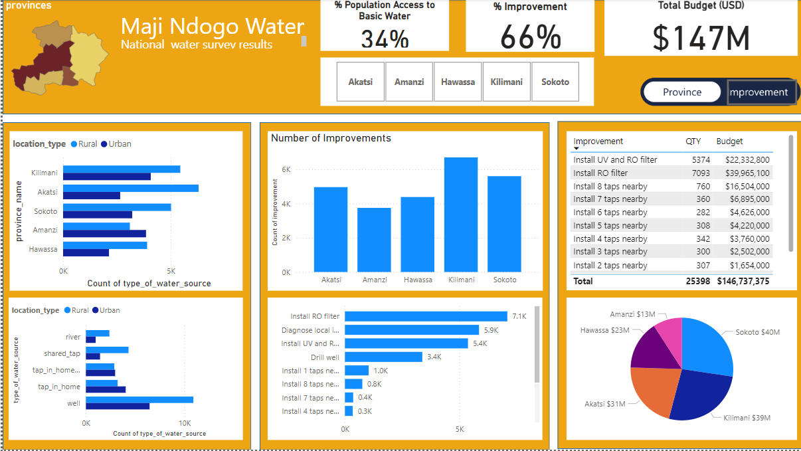

# Maji Ndojo National Water Survey Analysis
## Part 3: Communicating Findings in Maji Ndogo
[Download_PowerBI_Report_Here](part_3.pbix)
***

  

***

### Contents
- [Project Overview](#project_overview)
- [Findings](Findings)

***

**Author**: 
* [Kelvin SIla](https://github.com/ksila01)
***
  
## Project_Overview
The national dashboard provides a comprehensive overview of the current state of water access in the Maji Ndogo region. It highlights key metrics, including population breakdown, challenges, budget allocations, current access levels, and the costs associated with improving water sources. This dashboard serves both as a tool for public transparency and as a vital resource for decision-makers to monitor and guide the ongoing project.

***
## Findings

  

* **Total Budget & Financial Needs**:

* The total budget allocated so far amounts to $147 million. However, the projected total requirement to fully address the water access challenges is approximately $300 million.
* **Cost Distribution**: The province of Sokoto has the highest expenditure, while Amanzi incurs the lowest costs.
* **Improvement Costs**:

* **Major Investments**: The most significant budget allocations have been directed toward improving Reverse Osmosis (RO) filters and drilling wells.
Improvement Details: The dashboard tracks a variety of improvements, from the installation of taps to the deployment of filtration systems, ensuring a clear view of resource allocation.
* **Progress Indicators**:

* **Improvement Rat**e: The project has achieved a 66% improvement in water infrastructure across the region.
* **Population Access**: Currently, 34% of the population has access to basic water services, reflecting substantial progress but also indicating the need for continued efforts.
* **Regional Disparities**:

* **Provincial Analysis**: The number of improvements and types of water sources vary significantly across provinces. For example, Kilimani and Sokoto show a higher count of improvements, while Amanzi is the least developed in this regard.
* **Water Source Distribution**:

* **Rural vs. Urban Access**: There is a clear distinction in the types of water sources available in rural versus urban areas, with rural areas relying more on wells and shared taps, while urban areas have greater access to in-home taps.
* **Public & Stakeholder Engagement**:

* **Transparency & Accountability**: The dashboard is designed to provide the public with visibility into the progress being made while also offering stakeholders and decision-makers detailed insights for effective management.
